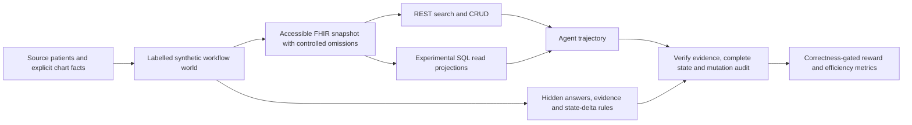

# FHIR Workflows: benchmark design, version 0.1

The target skill is finding chart evidence and carrying out an explicitly requested chart change, with a small local agent. The benchmark separates this from diagnosis, treatment selection, and autonomous payer decisions. FHIR means Fast Healthcare Interoperability Resources; CRUD means create, read, update, and delete. The first deliverable is a reproducible research environment, not a deployment-ready EHR integration.

## What the source actually contains

Synthetic Hospital v1.3 has 1,268 patients: 800 train, 200 public, and 268 heldout. Preserve these assignments. Its released SQLite database contains patient profiles, longitudinal notes, chart sections, and annotation tables. [Data card](https://github.com/sparkcpark/synthetic_hospital/blob/main/DATA_CARD.md).

The checked source commit is `911f34c4ac65a508543c4b3b90c373a0cd16534d`. Inspection of `epic_sim/app/fhir/capability.py` and `routers/fhir.py` shows nine clinical resource types exposed through GET routes: Patient, Encounter, Condition, Observation, DiagnosticReport, ServiceRequest, DocumentReference, MedicationRequest, AllergyIntolerance. CodeSystem and ValueSet cover terminology. This is an existing FHIR simulation, but the declared clinical interactions are read/search, not CRUD. Some resources are projections from graph findings or note sections rather than independent longitudinal transactional records.

Do not turn hidden `primary_diagnoses`, diagnosis annotations, or original benchmark answer labels into agent-visible clinical facts. The upstream README itself documents label leakage in some endpoints. Import explicit profile facts and notes, retain their provenance, and put our new workflow labels outside the agent-visible store. A generated clinical world supplies controlled known omissions; it does not establish complete biological truth for the source patients.

## Dataset construction

Retain every source patient and note. Expand depth before population size. Produce a source-preserving layer and a separately labelled synthetic workflow layer. New administrative episodes can be attached to the source identity. Clinical augmentation must be described as a constructed scenario, not inferred history. Keep a ledger identifying source table/key, transformation version, generator seed, generated versus source-derived status, and omission interventions.

| Layer | Resources | Construction |
|---|---|---|
| Source preservation | Patient, Encounter, DocumentReference | Exact notes as base64 text attachments; synthetic identifiers/names/birth dates explicitly labelled as generated |
| Explicit profile facts | Condition, AllergyIntolerance, MedicationStatement | Text-only concepts unless an exact coding is available; no invented terminology mappings or allergy reactions |
| Clinical workflow episodes | ServiceRequest, Specimen, Observation, DiagnosticReport, MedicationRequest, Procedure | Consistent order → specimen → result → report graphs, requested corrections/cancellations; added clinical facts labelled synthetic |
| Continuity and logistics | Communication, Task, CarePlan, Goal, Appointment, RelatedPerson | Telephone messages, follow-up work, transfers, caregiver coordination, scheduling |
| Insurance/evidence | Coverage, Organization, Questionnaire, QuestionnaireResponse | Administrative insurance changes and a fictional prior-authorization evidence checklist |
| Shared context and lineage | Practitioner, PractitionerRole, Location, Provenance | Reusable organizations/providers, resource-level source attribution, stable references |

Suggested expanded research target: 80–200 resources per patient across 5–10 years when clinically coherent, with a long tail. Do not force every patient to have every resource type. The first implementation uses bounded, deterministic episodes to validate the infrastructure; it is not evidence that this target distribution is clinically representative. A later Synthea-based generator can provide additional longitudinal clinical modules; never paste an unrelated Synthea patient's full chart onto a source patient. [Synthea's official generator](https://github.com/synthetichealth/synthea).

Maintain two views: the constructed latent world and the accessible EHR. Missingness includes a genuinely absent documented event, an event withheld from this EHR, a missing field, stale result, explicit negative finding, conflicting entries, and a resource unavailable to the current role. The correct response concerns what is documented and accessible. No-result search does not prove a clinical event never happened. Only synthetic-world interventions have complete ground truth for omissions.

Generate task definitions from the final accessible graph before writing natural-language instructions. Gold labels include answer fields, alternative acceptable evidence sets, allowed/required state changes, protected fields, and absence search scopes. An LLM may paraphrase prompts, but must not generate or alter the verifier's truth. Adaption is initially an experiment in workflow proposals and prompt variety; deterministic compilation and validation decide whether a proposal enters the benchmark.

## Task families and realistic instructions

| Family | Example instruction and dependencies | Expected operation |
|---|---|---|
| Direct chart lookup | Using the known MRN, identify current insurance or the latest documented lab result | R |
| Identity resolution | A caller supplies a name and approximate age; two candidates match, so request the missing identifier before changing anything | R + clarify |
| Result follow-up | Identify the completed report for an order, then retrieve its linked observations and latest corrected values | R |
| Telephone update | Read the chart, record the caller's reported information with its source, and create a follow-up task; do not silently convert a report into a confirmed diagnosis | R+C |
| Coverage transition | Find the old active plan, terminate it on the requested date, create the new coverage, preserve subscriber/beneficiary and unrelated fields | R+U+C |
| Order cancellation | Resolve the order and its outstanding fulfilment task, cancel both with a reason, preserve completed results | R+U |
| Chart correction | Mark the explicitly identified erroneous result `entered-in-error`; do not hard-delete valid history | R+U |
| Duplicate draft cleanup | Read two duplicate, unreferenced draft administrative tasks and DELETE only the specified erroneous one | R+D |
| Transfer preparation | Locate recent encounter, orders, reports and medications, gather cited evidence, flag unavailable external records, and create a coordination task | R+C |
| Medication reconciliation | Identify reported medication versus prescription/dispensing evidence; record a requested factual reconciliation without selecting treatment | R+U+C |
| Prior-auth evidence | For a fictional dated policy, cite documented requested-service and prerequisite evidence, report gaps and conflicts, create an evidence draft | R+C |
| Recovery under contention | A concurrent chart edit makes the agent's ETag stale; re-read and preserve that edit before applying the requested change | R+U |

Initial code implements a subset. The others remain expansion requirements, not claims of implemented coverage. Request handling through Communication/Task follows the [FHIR workflow model](https://hl7.org/fhir/R4/workflow-communications.html). The fictional prior-auth track borrows the documentation collection pattern from [Da Vinci DTR](https://hl7.org/fhir/us/davinci-dtr/2.2.0/en/specification.html); it does not implement PAS, CQL, payer submission, or determine medical necessity. Publish clinician-review status for each family before presenting a release as clinically validated.

## Difficulty and curriculum

Store three independent numbers:

1. `dependency_depth`: longest chain of necessary information dependencies after facts explicitly supplied in the request are removed. Example: identifier → patient → request → report → observation. Graph depth is not the number of returned resources.
2. `reference_calls`: calls used by a validated reference strategy on this exact capability profile. This is an upper bound, not a proven optimum. Use `minimum_calls` only when exhaustively proven for a finite action space.
3. Actual sequential rounds, tool calls, primitive REST operations, and writes. A transaction contains several primitive actions. Parallel calls within a model turn count once as a round and individually as calls.

The implemented compiler stores a template-declared `retrieval_dependencies` DAG and derives `dependency_depth` from it. `workflow_depth` adds the final required write stage, so retrieval reaches depth 4 and workflow execution can reach depth 5. An include may collapse the report/result retrieval into one call without changing the graph depth. These annotations are explicit task prerequisites, not a proof that every query strategy needs that many calls.

Curriculum: direct reads, identity plus temporal/status filters, reference traversal with distractors and missingness, then dependent writes and recovery. Add unseen family combinations and terminology paraphrases rather than only increasing the number of patients. Report distinct workflow families, graph topologies, prompt templates, source clusters, omission mechanisms, and unique patient instances separately; do not equate template multiplication with independent task diversity.

Partition at patient and source-material-cluster level. Within the 800 upstream training patients, reserve a deterministic development subset. Public evaluation can be used for reporting, not iterative tuning; upstream heldout is the final lockbox. A split-specific generator seed must not encode the correct answer or omission condition. Patient IDs and resource IDs must not reveal labels. A separate future family-holdout evaluation will test compositional generalization. Frozen task manifests are versioned and hashed before training.

## FHIR versus SQL comparison

Pin FHIR R4 4.0.1. Publish an executable capability profile. Supported search parameters are type-specific; reject unsupported parameters rather than silently ignore them. Add paging, repeated parameters, token systems, temporal filtering, sorting, selected chaining and `_include` progressively. Full R4 search is a later conformance target. [FHIR search specification](https://hl7.org/fhir/R4/search.html).

SQL on FHIR is a tabular view layer, not a portable SQL write API. Version 2.0.0 defines ViewDefinitions over single resource types using FHIRPath. Use portable documented projections plus SELECT joins for the read track. Label an ad hoc SQLite projection implementation as experimental until it passes a ViewDefinition runner's conformance suite. [Published SQL on FHIR 2.0.0](https://sql-on-fhir.org/ig/2.0.0/). The newer 3.0 ballot must be a separately pinned future profile.

Compare REST-only, SQL-read plus REST-write, and combined access on identical tasks and snapshots. Keep budgets, returned-field scope, row/resource caps, identity resolution, and snapshot freshness comparable. SQL views must be refreshed after committed writes. Both routes must encounter the same inaccessible facts. Record SQL-to-REST equivalence tests. Do not compare call counts without reporting bytes, rows, primitive operations, correctness and evidence coverage.

## Verifier and rewards

Require a structured final answer with evidence references. Exact values, requested statuses, references, chronology and the resulting chart state are objectively checked; free prose is auxiliary. Score answers against accessible EHR truth, not an inaccessible latent event. Multiple evidence paths and semantically equivalent query sequences are acceptable. A citation only counts if the relevant evidence was actually exposed during the rollout; an ID-only projection does not establish that a result value was read.

Score the whole state delta: requested changes, no unauthorized edits, no wrong-patient writes, no deleted valid history, preserved protected fields, no duplicate creates and no broken references. A bad write cannot be erased from the audit by later restoring the original value. Use ETags for optimistic concurrency, unique conditional-create identifiers for idempotency and transaction rollback for dependent changes. Deletion and cancellation have different semantics in [FHIR HTTP interactions](https://hl7.org/fhir/R4/http.html).

Baseline reward: zero unless the answer, evidence, final-state changes and write safety all pass. On success, award `1 - efficiency_weight * min(1, excess_cost / cost_budget)`, with efficiency_weight initially zero and later at most 0.15. Never reward query length, extra joins, early termination, or a partial evidence hit directly. Log partial evidence recall as a diagnostic before experimenting with dense shaping. Invalid or unsafe actions must not earn credit. Additional adversarial tests should target reward hacking.

## Metrics and paper figure

Primary: strict task success; required-state success; evidence precision/recall; wrong-patient or unauthorized mutation rate; justified abstention/clarification; preserved-field and reference integrity. Report bootstrap confidence intervals by patient/source cluster, not by template row.

Efficiency: first relevant result call/round, first query that exposes relevant evidence, all-required-evidence call/round, successful completion calls/rounds, total primitive operations, tool errors, repeated queries, response bytes/resources/rows, model input/output tokens, wall-clock latency and inference cost. Failed searches are right-censored at the budget; use success-at-budget curves, and report success-conditioned latency alongside them. Counts from checkpoints must use the same frozen evaluation cases to avoid easier-task selection effects.

Query structure: UTF-8 bytes and characters; FHIR parameter count, distinct predicates, chained-reference depth, `_has`, `_include`/`_revinclude`, temporal/status restrictions, pagination; SQL AST predicate count, joins, subqueries, grouping and selected columns. These are explanatory features, not measures of skill. Longer or more elaborate queries may be worse.

The proposed figure has checkpoint on the x axis, strict success and calls-to-evidence curves with uncertainty on the left, and actual same-task query traces at selected checkpoints on the right. Do not fabricate a decreasing training curve. Save trace/task IDs for the examples and select cases according to a predeclared rule.

The retrieval-subagent idea is consistent with [Chroma Context-1](https://www.trychroma.com/research/context-1), which separates evidence retrieval from downstream answering and uses SFT then RL. [Engram/Harvey's legal benchmark](https://www.harvey.ai/blog/legal-agent-bench-law-firm-knowledge) motivates distributed evidence tasks. Their results are not evidence that FHIR search or PHI minimization will work without independent evaluation. Selected snippets can still contain PHI; local retrieval alone does not make sending them to an API private.

## Implementation and release gates

Use a per-rollout isolated store with immutable source snapshots, write overlays, audit logs and deterministic reset. The initial in-process simulator enables CPU tests without Docker. A later server adapter must replay reference traces against HAPI or another independent FHIR server, test CapabilityStatement conformance and execute the official FHIR validator's FHIRPath invariants. JSON-schema validation alone does not establish full FHIR conformance or clinical consistency.

The environment was initialized using `prime env init fhir-workflows --multi-file`. Package a `load_environment` loader, declare all dependencies, include schemas and default pilot data in the wheel, and verify the installed wheel from a clean directory. Pin the tested Verifiers version. Legacy StatefulToolEnv remains a documented compatible route; the newer taskset/harness API is a future migration. [Environment development and upload](https://docs.primeintellect.ai/tutorials-environments/create).

Current Prime hosted docs say shared LoRA training stops accepting new runs October 5, 2026 and dedicated training is the successor. The dedicated service uses the current native source-table schema; this implementation prepares that recipe with the Verifiers legacy environment bridge (`env.id`, `env.args`). Verify account eligibility and trainer schema/model-cache constraints before committing training compute. No training run is started by this design. [Current hosted configuration](https://docs.primeintellect.ai/hosted-training/advanced-configs), [dedicated training](https://docs.primeintellect.ai/hosted-training/full-finetuning).

Hugging Face release layout: split-specific FHIR NDJSON, source/generated provenance ledger, task JSONL, hidden scoring files distributed separately where desired, immutable manifests and checksums, source notices, data card and limitations. Model release: training task version, model/license, hardware, seed, hyperparameters, checkpoint selection, reproducible evaluation and privacy limitations. Publish to HF and Prime only after the pilot, independent server checks, reviewer sign-off and explicit release instruction. The user requested eventual publication, so this turn prepares those artifacts without claiming an upload or trained model.
